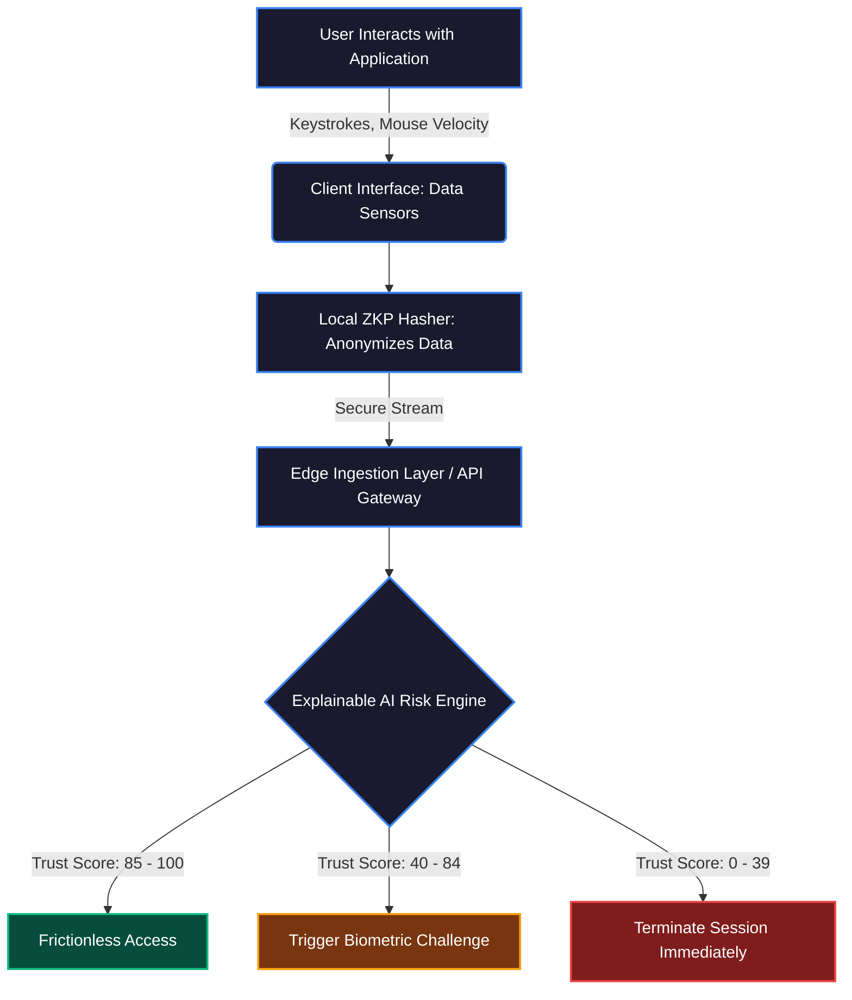

# PrismID: AI-Driven Identity & Trust Lifecycle Simulator

[](https://reactjs.org/)
[](https://vitejs.dev/)
[](https://www.typescriptlang.org/)
[](https://threejs.org/)

**PrismID** is a next-generation, AI-driven identity and trust lifecycle simulation platform. It is designed to demonstrate how modern security systems can continuously authenticate users in the background using behavioral heuristics, dynamic signal ingestion, and Zero-Knowledge Proofs (ZKP), without relying on static, high-friction authentication methods like traditional passwords.

---

## 🔄 The Continuous Trust Workflow

Traditional authentication relies on static passwords or one-time MFA tokens, which create high friction and leave sessions vulnerable to hijacking. PrismID shifts to **Continuous Trust Scoring**.



---

## 🏛 System Architecture

PrismID operates across a robust, multi-tiered architecture that securely transmits and analyzes telemetry data in real time.

1. **Tier 1: Client Interface (User Endpoint)**
   - **Data Sensors:** Constantly captures behavioral heuristics and device-level telemetry.
   - **Local ZKP Hasher:** Cryptographically anonymizes all behavioral data *before* it leaves the user's device, ensuring strict privacy compliance.

2. **Tier 2: Edge Ingestion Layer**
   - **Telemetry API Gateway:** Receives the continuous stream of anonymized telemetry packets.
   - **Tamper-Proof Audit Ledger:** Immutably records every packet, score recalculation, and system event for forensic review.

3. **Tier 3: Explainable AI Risk Engine**
   - **Behavioral Pattern Matcher:** Compares incoming data against established user baselines.
   - **Risk Heuristics Engine:** Calculates live threat vectors based on anomalies.
   - **XAI Rationale Generator:** Translates algorithmic weights into human-readable data to prevent "black box" lockouts.

4. **Tier 4: Dynamic Friction Controller**
   - Continuously adjusts the security posture of the session based on the AI's Trust Score output.

---

## ✨ Key Features & Value Proposition

- 🛡️ **Invisible Security:** Legitimate users experience zero friction. They are authenticated continuously in the background.
- ⚡ **Real-Time Threat Response:** Automatically introduces friction (like a biometric challenge) or halts the session the moment anomalies are detected.
- 🔒 **Zero-Data Exposure:** Uses Zero-Knowledge Proofs to validate users without the server ever seeing or storing raw telemetry data.
- 🧠 **Transparent Rationale (XAI):** Every security decision is explained explicitly, detailing the mathematical weights that led to an account lock or challenge.

---

## 🛠 Technology Stack

| Layer | Technology | Purpose |
| :--- | :--- | :--- |
| **Framework** | React 18, TypeScript, Vite | Core logic, strict type-safety, and fast development. |
| **Styling** | Vanilla CSS | Custom "Glassmorphism" UI, dynamic neon glows, and fluid animations. |
| **3D Rendering** | Three.js, React Three Fiber | Renders the interactive "Trust Sphere" representing global network nodes. |
| **Data Viz** | Recharts, Custom SVGs | Responsive bar charts for XAI breakdowns and keystroke tracking. |
| **Icons** | Lucide React | Clean, scalable vector icons used throughout the dashboard. |

---

## 🚀 Getting Started (Local Development)

To run the PrismID simulator locally on your machine:

1. **Clone the repository:**
   ```bash
   git clone https://github.com/GANESHMALLEPAKA/PrismID.git
   cd PrismID
   ```

2. **Install dependencies:**
   ```bash
   npm install
   ```

3. **Start the development server:**
   ```bash
   npm run dev
   ```

4. **Build for production:**
   ```bash
   npm run build
   ```

## 🎮 How to Use the Simulator

1. **Landing Page:** Scroll through the technical overview and interact with the 3D Sphere. Click the **Launch System Simulator** button to enter the operations center.
2. **Select a Threat Scenario:** On the right-hand panel of the dashboard, toggle between different scenarios (e.g., *Trusted Corporate Access*, *Bot Network Attack*).
3. **Observe the AI Engine:** Watch the "Trust Score" recalculate in real-time. Notice the dynamic background color changes based on the threat level.
4. **Read the XAI Rationale:** Analyze the bar charts to see exactly *why* a score dropped (e.g., impossible travel, abnormal typing speed).
5. **Review the Audit Ledger:** Watch the real-time, terminal-style log of events on the left-hand panel.

---

*Designed for the future of continuous authentication.*
